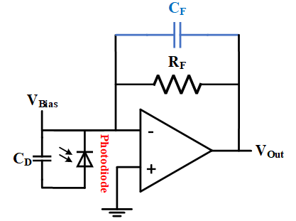
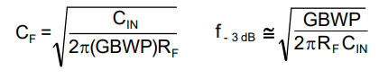
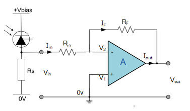
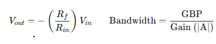
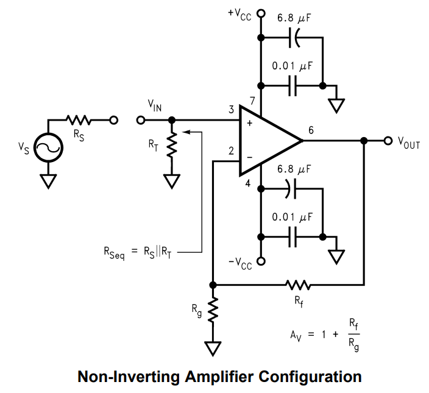
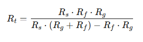
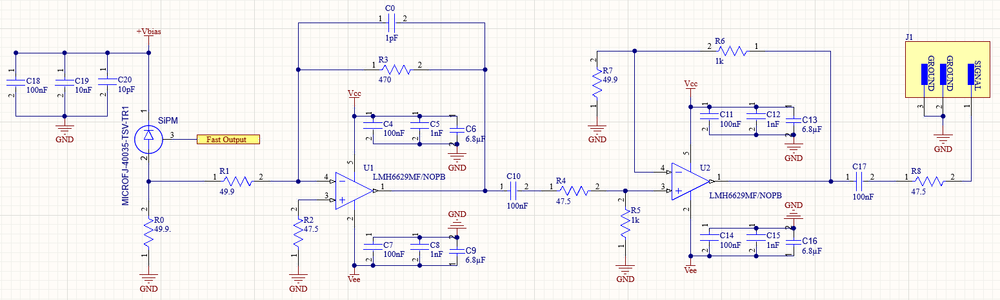
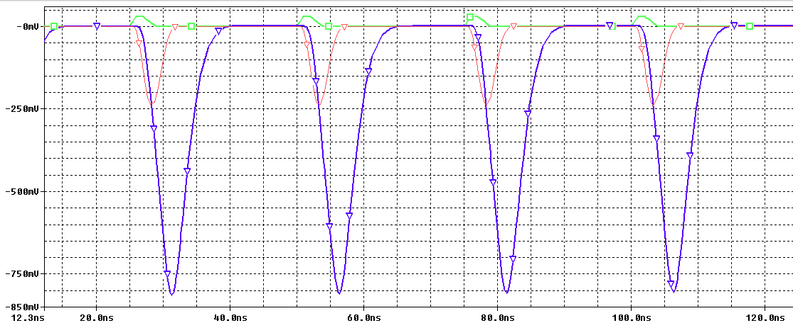

# Schematic of Circuit

For the preamplification stage, there are two options: design a transimpedance amplifier (TIA) or an inverting amplifier. Based on this, an operational amplifier is selected considering the following 3 criteria: *a unity-gain bandwidth of at least 1 GHz, input voltage noise less than 5 nV/√Hz, and a stable gain AV ≥ 10*. An operational amplifier with these characteristics can be used to amplify the SiPM signal with a pulse width of a few tens of nanoseconds without introducing significant noise at the 50 Ω output.

**1.- Transimpedance Amplifier TIA:** A TIA is an amplifier that converts an input current signal into a voltage signal. It is commonly used in applications where the input signal is current, such as in SiPM. For its design, the following equations must be considered to calculate the feedback capacitance Cf and the cutoff frequency Fc at a given gain. For more information you can review this [article](https://www.ti.com/lit/an/sboa122/sboa122.pdf). 

>! **Caution** 
>!
>! From the equations, it can be determined that higher gain results in lower bandwidth and a smaller optimal value for Cf, which is recommended to be greater than 1 pF. Values smaller than this begin to be significantly affected by the parasitic capacitances of the PCB. Additionally, you must consider the minimum gain at which the selected amplifier is stable.

**2.- Inverting Amplifier:** An inverting amplifier is a configuration where the input signal from SiPM is applied to the inverting input of the operational amplifier, while the non-inverting input is grounded. For its design, the following equations must be considered to calculate the feedback resistance Rf and bandwidth. The higher the gain, the lower the bandwidth. For a gain of AV = 10, the bandwidth is reduced to 150 MHz if GBP of amplifier is 1.5GHz. 

>i **Note** 
>i
>i You can add a feedback capacitance Cf in parallel with the feedback resistor Rf. This way, the amplifier will also function as a low-pass filter, with a cutoff frequency Fc=1/(2PiRfCf). It is recommended to use the amplifier with a ±Vcc supply. Otherwise, if only a +Vcc source is used, you must generate an offset and decouple the amplifier's input from the SiPM output with a capacitor.

**3.- Non-inverting amplifier:** The non-inverting amplifier has a higher gain than the inverting amplifier, but its bandwidth is limited. For the proper use of the amplifier, you must cancel the bias currents by incorporating a resistance Rt at the + input pin of the amplifier, which is calculated using the following equation.

>i **Note** 
>i
>i For the inverting amplifier, it is also recommended to add a resistor at the + pin to ground to cancel the bias currents. This resistor is obtained from Rf//Rin.

**4.- Final design:** A circuit is designed to allow testing of either the TIA topology or an inverting amplifier in the preamplification stage, followed by an amplification stage with a non-inverting amplifier. You can download the schematic from [here](doc/Sheet_SiPM.SchDoc). (It includes the power supply circuit, as it will be part of the same PCB).

|  Topology | R0[Ω] | R1[Ω] | R2[Ω] | R3[Ω] | C0 [pF] |
|:------:|:--------:|:-------:|:-------:|:-------:|:-------:|
| TIA |     NC   |  0  | 10 | 1k | 1 |
| Inverter |  49.9       |  49.9  | 47.5 | 511 | 2 |

>i **Note** 
>i
>i The amplification stage can be omitted if from preamplification stage the pulses have enough amplitude. This depends on the number of photons that will hit the sensitive area of ​​the SiPM and the gain of the photomultiplier, which is proportional to the size of the pixel.

Additionally, the circuit was simulated with the real components to determine the stability of the signal amplifier of the SiPM under different conditions. You can download the PSpice project by clicking [here](doc/project_sipm-PSpiceFiles.rar) 

The green curve corresponds to the SiPM pulse, the red curve is the output of the preamplifier, and the blue curve is the output of the non-inverting amplifier. **Consider that the amplitude of the SiPM pulse will depend on the light incident on its sensitive area.**

