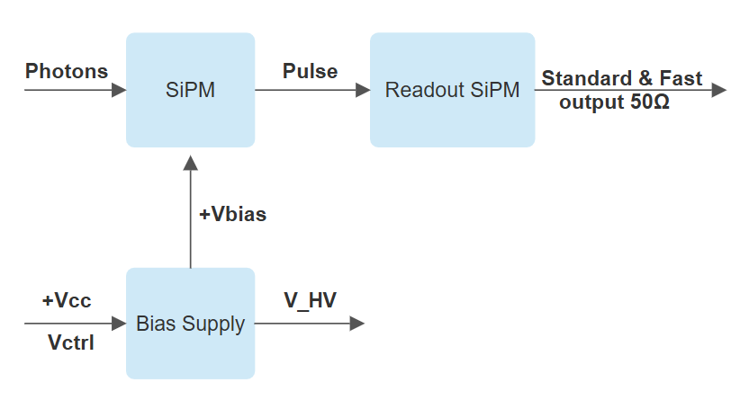

# SiPM Module detector

This is our open-source hardware and custom electronics solution for SiPM module detector. It is used as part of "Ritmos,” our Real-time Technology for Microfluidic Droplet Sorting, as well as other microfluidics development projects. We implemented a board that includes the readout system to amplify SiPM signals to a measurable voltage with ultra-low noise, allowing the detection of a single photon. Additionally, a controllable voltage source is included, which enables the SiPM to be biased at different operating voltages. The readout provides a fast output with higher temporal resolution and a standard 50-ohm output with greater energy resolution. The SiPM detector module works with a single +5V power supply and a control voltage (Vctrl) in the range of 0-3.3V, allowing adjustment of the final SiPM bias voltage.

To explore the documentation, please use the links below:

- [SiPM](testpage7.md)
	- [Go to TSV_Pin_Adapter_board](schematic3.md#TSV_Pin_Adapter_board)
- [Readout SiPM](testpage1.md)
	- [Go to Schematic_Redout_SiPM](Schematic.md#Schematic_Redout_SiPM)
- [Bias Supply](testpage5.md)
	- [Go to Schematic_Controllable_Bias_Supply](schematic2.md#Controllable_Schematic_Bias_Supply)
 

## References

>i **Note:** This system builds upon resources from:
>i 
>i 1.- *Giancarlo Barbarino et al. "Silicon Photo Multipliers Detectors Operating in Geiger Regime: an Unlimited Device for Future Applications", [Photodiodes](https://www.intechopen.com/chapters/17225) (2011)*
>i
>i 2.- *Brae V Petersen et al. "Silicon Photomultipliers as a Low-Cost Fluorescence Detector for Capillary Electrophoresis", [Anal Chem](https://pmc.ncbi.nlm.nih.gov/articles/PMC7728455/#SD1) 2020*
