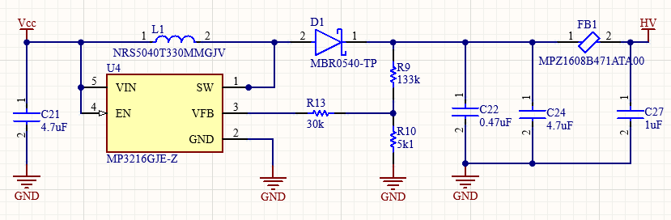
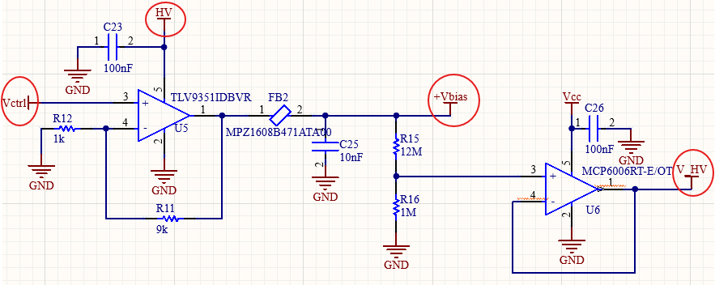
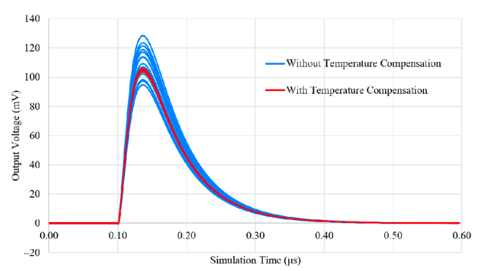

# General Schematic

The circuit is divided into 2 sections detailed below. You can download the schematic from [here](doc/Sheet_SiPM.SchDoc). (It includes the readout circuit, as it will be part of the same PCB).

## 1. Boost Converter

The [MP3216](https://www.monolithicpower.com/en/documentview/productdocument/index/version/2/document_type/Datasheet/lang/en/sku/MP3216/document_id/1113) integrated circuit is chosen as the boost converter for this design. Key components such as inductor 33uH, capacitors, and feedback resistors are used to regulate and stabilize the voltage. The MP3216 is well-suited for compact designs and efficient power conversion, ensuring a steady voltage supply to the SiPM bias system.

>i **Note** 
>i
>i An RC filter is added at the output of the converter to reduce voltage ripple to 1mVpp. Instead of a standard resistor, a ferrite model [MPZ1608B](https://product.tdk.com/en/system/files/dam/doc/product/emc/emc/beads/catalog/beads_commercial_power_mpz1608_en.pdf) is used. Its DC resistance is only 150mΩ, and at the 1MHz switching frequency, its impedance is approximately 75Ω.

## 2. Controllable Amplifier 

The cost-optimized operational amplifier model [TLV9351](https://www.ti.com/lit/ds/symlink/tlv9354.pdf?HQS=dis-dk-null-digikeymode-dsf-pf-null-wwe&ts=1728463575690&ref_url=https%253A%252F%252Fwww.ti.com)  is selected, which can be powered with up to 40V (HV point). It is configured to have a gain of x10 with respect to the voltage Vctrl. Then, an RC filter is added to eliminate high-frequency noise to obtain an appropriate bias voltage (Vbias point) for the SiPM. Finally, a buffer model [MCP6006](https://ww1.microchip.com/downloads/aemDocuments/documents/APID/ProductDocuments/DataSheets/MCP6006-6R-6U-7-9-Data-Sheet-20006411B.pdf) with high input impedance is included, allowing monitoring of the high voltage (V_HV point).  
 

The voltage ranges for each point are as follows:

|  Vctrl [V] | HV [V] | +Vbias [V] | V_HV [V] |
|:------:|:--------:|:-------:|:-------:|
| 0 - 3.3 |    33     |   0 - 33 | 0 - 2.54 |

>
>!! **Warning** 
>!!
>!! You should limit the control voltage Vctrl depending on the maximum operating voltage of the selected SiPM. For example, if the maximum operating voltage is 30.7V, then the Vctrl voltage should not exceed 3.07V. Additionally, for high voltage monitoring, it is recommended to use an ADC with at least 12 bits, allowing Vbias adjustments with a resolution of ±10mV.
>

>i **Note** 
>i
>i Consider that the gain of SiPMs is dependent on ambient temperature, with a Vbias adjustment factor between 20-30mV/°C. Specifically, if the temperature increases, the gain will decrease, so you should to know what voltage amplitudes you will consider in your experiment. If you want to differentiate fluorescence levels, you should include temperature monitoring and adjust the control voltage Vctrl accordingly. 
>

***Reference:** Nile E. J. Dixon et al. "Compact Back-End Electronics with Temperature Compensation and Efficient Data Management for In Situ SiPM-Based Radiation Detection",  Sensors 2023.*

