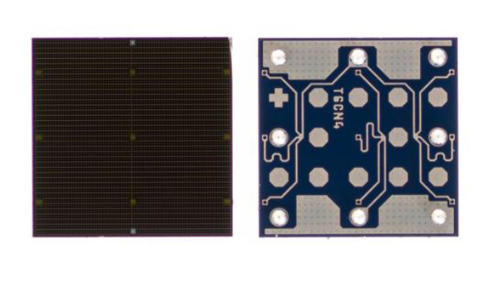
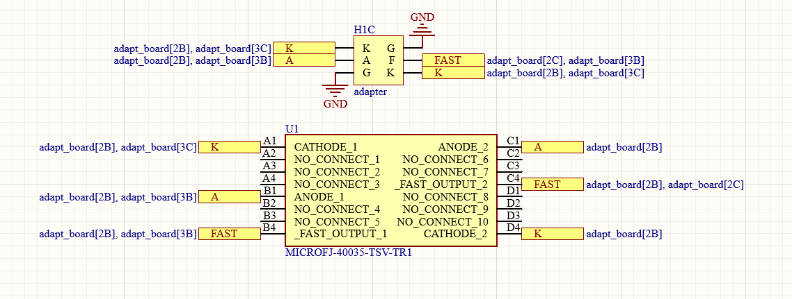
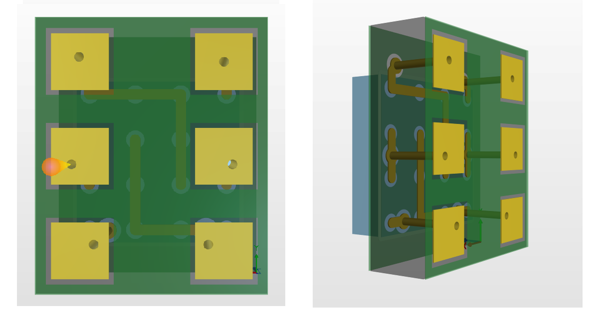

# TSV Pin Adapter board

An adapter board for the SiPM is designed to allow easy connection between the silicon photomultiplier 4x4mm TSV(Through Silicon Via) and the readout. You can download the schematic and the PCB layout from [here](doc/adapt_board.zip)

