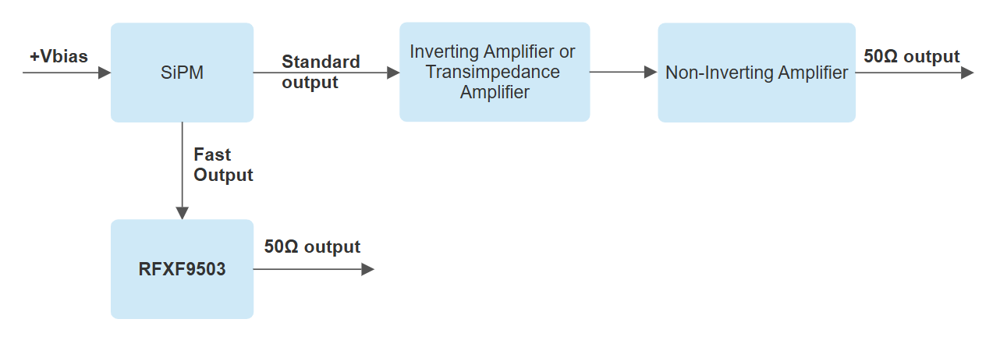

# Redout SiPM

A two-stage amplifier is designed to detect up to a single photon with high bandwidth. It includes a fast output with higher temporal resolution and a standard output with higher energy resolution, allowing for differentiation of the number of photons being detected.

 

## Design Specifications

These instructions will guide you on how to design and assemble the readout of SiPM. You can access the project by clicking here **[SiPM Detector Module]( https://github.com/wenzel-lab/SiPM-detector-module)**

* [Schematic_Redout_SiPM](Schematic.md){step}

