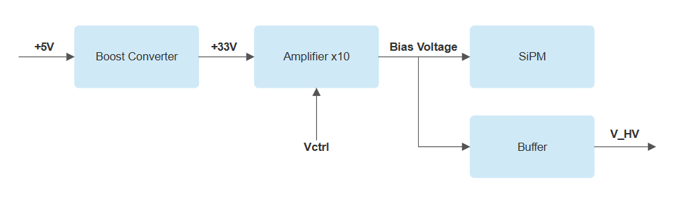

# Bias Supply

This circuit generates a continuous voltage of up to 33V to bias a silicon photomultiplier (SiPM). The first stage amplifies the input voltage using a boost converter, supplying power to a high-voltage operational amplifier. This amplifier is configured with a gain of 10 relative to a control signal (Vctrl) with a voltage range according to LVTLL standard (0 - 3.3V). This setup provides a controllable bias voltage across the full SiPM operation range. Additionally, a buffer is included for monitoring the high voltage (V_HV) set by the user.

 

## Design Specifications

These instructions will guide you on how to design and assemble the bias supply for SiPM. You can access the project by clicking here **[SiPM Detector Module]( https://github.com/wenzel-lab/SiPM-detector-module)**

* [Schematic_Controllable_Bias_Supply](schematic2.md){step}

