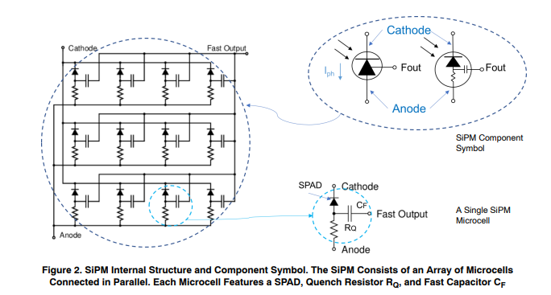
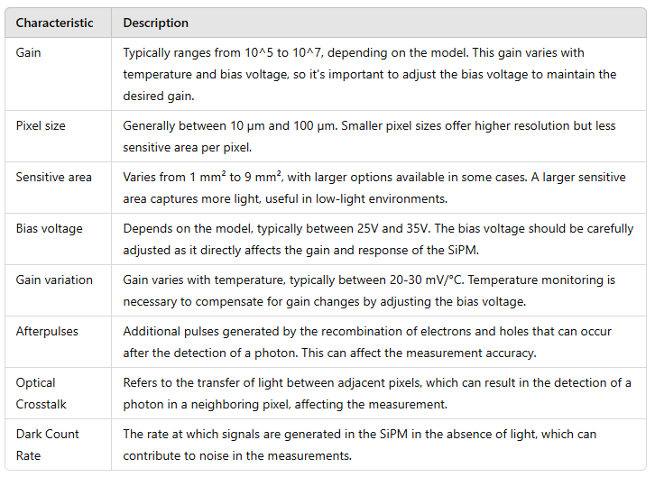
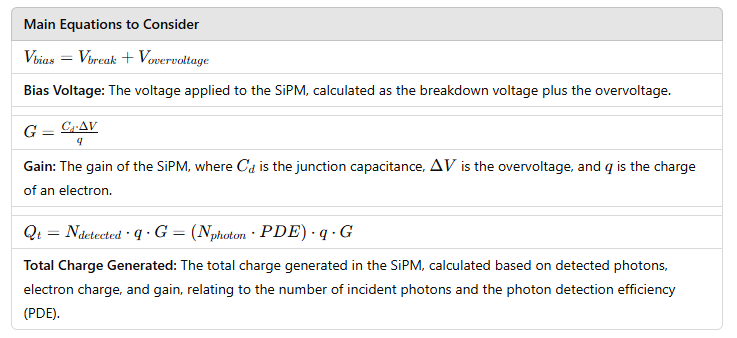
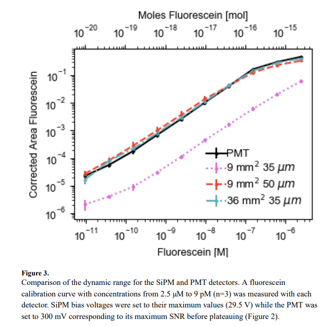

# Silicon Photomultipliers

Silicon Photomultipliers (SiPMs) are silicon-based photomultipliers capable of detecting individual photons. They are primarily used in low-light detection applications, such as particle physics, radiation detection, among others. If you would like more information, you can access this [site](https://hub.hamamatsu.com/us/en/technical-notes/mppc-sipms/what-is-an-SiPM-and-how-does-it-work.html).

In the article of Brae V. Petersen et al. different SiPMs (9 mm² and 36 mm²) and microcell sizes (35 μm and 50 μm) were evaluated to determine their limit of detection (LOD) and dynamic range compared to photomultiplier tubes (PMTs). The results demonstrated that the SiPMs can detect fluorescein across a concentration range of 10^-12 to 10^-5 M, achieving performance characteristics comparable to those of PMTs.

The 36 mm² SiPM exhibited the highest sensitivity but also experienced saturation at higher concentrations. In contrast, the 9 mm² SiPM with 35 μm microcells showed a better dynamic range, attributed to its shorter dead time. This allows for a quicker response to successive signals and improved resolution in event detection, minimizing signal overlap and optimizing data collection in high event frequency situations.

Considering the above, the SiPM model [MICROFJ-40035-TSV-TR1](https://www.onsemi.com/pdf/datasheet/microj-series-d.pdf) has been chosen, which features a sensitive area of 16 mm² and pixels of 35 μm. This way, sensitivity is increased without significantly reducing the dynamic range compared to a 36 mm² SiPM.

## Design Specifications

These instructions will guide you on how to design and assemble the SiPM.  You can access the project by clicking here **[SiPM Detector Module]( https://github.com/wenzel-lab/SiPM-detector-module)**

* [TSV_Pin_Adapter_board](schematic3.md){step}

